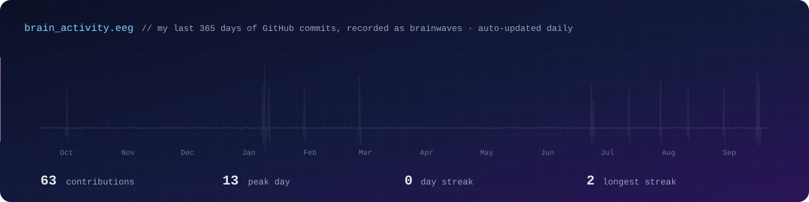
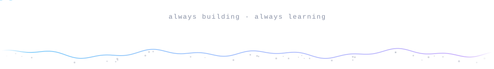

  

  
  

### 🧠 About Me

I'm a B.Tech **Artificial Intelligence & Data Science** student at **Amrita Vishwa Vidyapeetham, Coimbatore** (2024–2028). I like projects where the math actually matters, whether that's reconstructing brain signals, protecting qubits from noise, or making deep networks trainable.

- 🔬 Exploring **deep learning research**, **quantum error correction**, and **distributed data systems**
- ⚙️ Comfortable across the stack, from neural network experiments to Spark clusters to Raspberry Pi and Jetson Nano hardware
- 🎯 Open to **AI/ML internships** and research collaborations

### 🚀 Featured Projects

| Project | What it does | Stack |
|---|---|---|
| ⚛️ **[Quantum Error Correction Simulation](https://github.com/Suman-Maitreya/quantum-error-correction-simulation)** | Simulates bit-flip, phase-flip, and 9-qubit Shor codes under depolarizing and amplitude damping noise, with pseudo-threshold analysis against analytical scaling laws | Qiskit · Python |
| 🧠 **[NeuroHologram](https://github.com/Suman-Maitreya/NeuroHologram---EEG-Reconstruction)** | Reconstructs 32-channel medical-grade EEG from sparse 4-channel consumer inputs using a hybrid U-Net and convex optimization (ADMM) approach | TensorFlow · Python |
| 📉 **[Vanishing Gradients & Orthogonal Filters](https://github.com/Suman-Maitreya/Vanishing-gradient-orthogonal-filters)** | Analyzes and mitigates vanishing gradients with Orthogonal Additive Filters, tested on MLPs, ResNet-18, and VGG-16 | PyTorch · NumPy |
| 🩺 **[MediSpark](https://github.com/Suman-Maitreya/MediSpark)** | Distributed multi-disease risk prediction on a 7-container Hadoop/Spark cluster, with a six-stage pipeline, real-time streaming, and a live dashboard | Scala · Spark · HDFS · Docker |
| 🚜 **[MTR-1 Rover](https://github.com/Suman-Maitreya/raspberry-pi-rover)** | A 6-wheel multi-terrain rover on Raspberry Pi 4, teleoperated through a Flask web interface | Python · Flask · Raspberry Pi |

### 🛠️ Tech Stack

### 📡 Brain Activity

